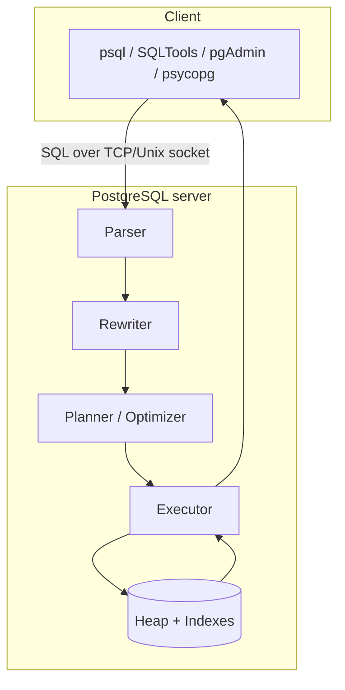
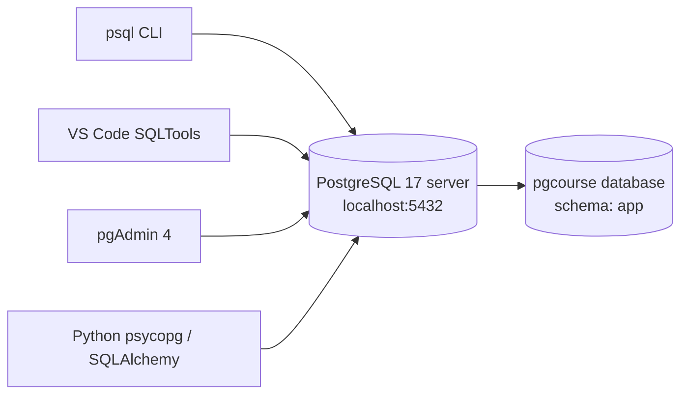

# 00 — Foundations

By the end you can:
1. Install PostgreSQL 17 natively on your machine and start the service.
2. Connect to it from `psql`, VS Code (SQLTools), and the bundled pgAdmin web UI.
3. Create the `pgcourse` database and load `seed/schema.sql` + `seed/data.sql`.

**Time budget:** 45 min reading + 30 min lab.

## The relational model in one paragraph

A relational database stores data in **tables** (a.k.a. relations). Each table is a set of **rows** (tuples) where every row has the same fixed set of **columns**. You query with SQL, a declarative language: you describe what you want, the planner decides how to get it. Postgres is an *object-relational* database — relational at the core, with first-class support for arrays, JSON, custom types, inheritance, and extensions like `pgvector`. See [Chapter 1 of the Postgres tutorial][pgtut].



## Install Postgres 17 (native)

Pick your OS. Each path installs the server, the `psql` CLI, and pgAdmin 4.

### Windows 11 (recommended path for this course)

1. Download the **EDB installer for PostgreSQL 17** from the official Postgres download page: <https://www.postgresql.org/download/windows/>.
2. Run the installer. Keep defaults except:
   - **Components:** keep `PostgreSQL Server`, `pgAdmin 4`, `Command Line Tools`. Stack Builder is optional.
   - **Data directory:** the default under `C:\Program Files\PostgreSQL\17\data` is fine.
   - **Password:** set a strong password for the `postgres` superuser. **Write it down** — you will put it in `.env`.
   - **Port:** keep `5432` unless it is taken.
   - **Locale:** `Default locale` is fine.
3. After install, the `postgresql-x64-17` service is set to start automatically. Open **Services** (`services.msc`) and confirm it is `Running`.
4. Add `C:\Program Files\PostgreSQL\17\bin` to your `PATH` if the installer did not. Test from a new PowerShell:
   ```powershell
   psql --version
   ```
   You should see `psql (PostgreSQL) 17.x`.

### macOS

```bash
brew install postgresql@17
brew services start postgresql@17
# brew does not set a password on the superuser; your OS user owns the cluster.
```

### Linux (Debian/Ubuntu)

Follow the official APT repository instructions: <https://www.postgresql.org/download/linux/ubuntu/>. After install:
```bash
sudo systemctl enable --now postgresql
sudo -u postgres psql -c "ALTER USER postgres WITH PASSWORD 'change_me';"
```

### Docker (optional alternative)

If you would rather not install natively, `docker compose up -d` in the repo root brings up `postgres:17` + pgAdmin. See [`../docker-compose.yml`](../docker-compose.yml). All later modules work identically against either backend.

## Connect three ways

### 1. `psql` (CLI)

The canonical Postgres client. Master a handful of meta-commands and you can do anything: <https://www.postgresql.org/docs/17/app-psql.html>.

```powershell
# Connect to the default 'postgres' database as the superuser
psql -U postgres -h localhost -p 5432 -d postgres
```

Inside `psql`:

| Command | Purpose |
|---------|---------|
| `\l`      | List databases |
| `\c db`   | Connect to database `db` |
| `\dt`     | List tables in the current schema |
| `\d name` | Describe a table/index/sequence |
| `\dn`     | List schemas |
| `\df`     | List functions |
| `\timing` | Toggle query timing |
| `\x`      | Toggle expanded display (long rows readable) |
| `\?`      | All meta-commands |
| `\q`      | Quit |

### 2. VS Code (SQLTools)

1. Install the extensions listed in [`../vscode/extensions.md`](../vscode/extensions.md).
2. Copy `vscode/settings.example.json` to `.vscode/settings.json` and replace `change_me` with your password.
3. Open the SQLTools sidebar, expand `pgcourse (local)`, click **Connect**.

### 3. pgAdmin 4 (web UI)

- **Windows:** launched by the EDB installer; find it in the Start menu. On first open you set a master password, then add a server with host `localhost`, port `5432`, user `postgres`, password from install.
- **Docker:** open <http://localhost:5050>, log in with the credentials in `docker-compose.yml`, then **Add New Server** → Host: `postgres` (the service name), port `5432`.

## Hello, Postgres

Run this in `psql` after connecting:

```sql
SELECT version();
SELECT current_database(), current_user, now();
```

You should see the server version, the current database, the connected user, and the current timestamp. That confirms the install, the network path, and authentication all work.

## Load the seed schema

The same schema and data are used in every module. Load them once:

```powershell
# From the repo root, in PowerShell
$env:PGPASSWORD = "change_me"   # or load from .env

psql -U postgres -h localhost -c "CREATE DATABASE pgcourse;"
psql -U postgres -h localhost -d pgcourse -f seed/schema.sql
psql -U postgres -h localhost -d pgcourse -f seed/data.sql
```

Verify:
```sql
-- Run inside: psql -U postgres -d pgcourse
SET search_path = app, public;
SELECT 'users', count(*) FROM users
UNION ALL SELECT 'posts',       count(*) FROM posts
UNION ALL SELECT 'comments',    count(*) FROM comments
UNION ALL SELECT 'products',    count(*) FROM products
UNION ALL SELECT 'orders',      count(*) FROM orders
UNION ALL SELECT 'order_items', count(*) FROM order_items
UNION ALL SELECT 'inventory',   count(*) FROM inventory;
```

Expected (approximate): 50 users, 400 posts, ~624 comments, 60 products, 200 orders, ~265 order_items, 180 inventory rows.

## Python sanity check (optional)

```powershell
python -m venv .venv
.venv\Scripts\Activate.ps1
pip install -r requirements.txt
python -c "import psycopg, dotenv; print(psycopg.__version__)"
```

Open [`lab.ipynb`](./lab.ipynb) for an end-to-end Python connection check.

## What you just set up



## References

- Postgres 17 manual: <https://www.postgresql.org/docs/17/index.html>
- `psql` reference: <https://www.postgresql.org/docs/17/app-psql.html>
- libpq env vars (used by `.env`): <https://www.postgresql.org/docs/17/libpq-envars.html>

## Next

[Module 01 — SQL Basics →](../01-sql-basics/)

[pgtut]: https://www.postgresql.org/docs/17/tutorial-arch.html
