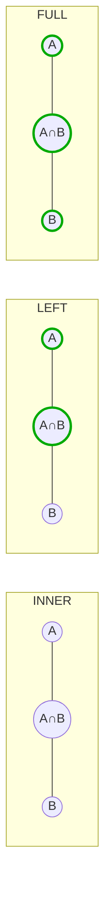

# 02 — Joins &amp; Aggregates

By the end you can:
1. Choose the right join (`INNER`, `LEFT`, `RIGHT`, `FULL`, `CROSS`, `LATERAL`) for a given relationship.
2. Compute group-level metrics with `GROUP BY`, `HAVING`, and filtered aggregates (`FILTER`).
3. Combine query results with `UNION`, `INTERSECT`, and `EXCEPT`.

**Time budget:** 45 min reading + 45 min lab.

## Joins, visualized



| Join | Returns rows from | NULLs appear when |
|------|-------------------|--------------------|
| `INNER JOIN` | both sides matching the predicate | never |
| `LEFT JOIN`  | every left row + matching right rows | right side has no match |
| `RIGHT JOIN` | every right row + matching left rows | left side has no match |
| `FULL JOIN`  | both, with non-matches kept | either side has no match |
| `CROSS JOIN` | Cartesian product (no `ON` clause) | never (no NULLs from join itself) |
| `LATERAL` join | right side is re-evaluated per left row | depends on inner query |

Rule of thumb: write `INNER JOIN` unless you need rows from one side regardless of the other. Then think `LEFT`. `RIGHT` is rarely worth writing — flip the operands and use `LEFT`. `FULL` is uncommon but invaluable for diffs.

## INNER JOIN

```sql
-- All posts with their author's email
SELECT p.id, p.title, u.email
FROM app.posts p
JOIN app.users u ON u.id = p.author_id
ORDER BY p.id
LIMIT 5;
```

The `ON` predicate is the join condition. `USING (col)` is shorthand when the column names match on both sides and you want a single merged column in the output.

## LEFT JOIN and "anti-join"

```sql
-- Users who have never posted
SELECT u.id, u.email
FROM app.users u
LEFT JOIN app.posts p ON p.author_id = u.id
WHERE p.id IS NULL;
```

The `p.id IS NULL` filter turns the `LEFT JOIN` into an **anti-join** (give me left rows with no right match). Postgres often plans this as a `Hash Anti Join` — the explicit `NOT EXISTS` form is equivalent and frequently clearer:

```sql
SELECT u.id, u.email
FROM app.users u
WHERE NOT EXISTS (SELECT 1 FROM app.posts p WHERE p.author_id = u.id);
```

Prefer `NOT EXISTS` over `NOT IN (subquery)` whenever the inner column can be NULL — `NOT IN` returns no rows if the subquery yields any NULL. Why: `NOT IN (..., NULL)` is `NULL`, which is treated as "not true", so the row is excluded.

## LATERAL: per-row subqueries

`LATERAL` lets the right-hand subquery reference columns from the left. Use it when you need a "top-N per group" or any computation parameterized by the left row.

```sql
-- Three most recent comments per post
SELECT p.id AS post_id, c.id AS comment_id, c.created_at
FROM app.posts p
CROSS JOIN LATERAL (
    SELECT id, created_at
    FROM app.comments
    WHERE post_id = p.id
    ORDER BY created_at DESC
    LIMIT 3
) c
ORDER BY p.id, c.created_at DESC;
```

Without `LATERAL`, the inner query cannot reference `p.id`. See [SELECT/LATERAL](https://www.postgresql.org/docs/17/sql-select.html#SQL-FROM).

## Aggregates and GROUP BY

| Aggregate | Notes |
|-----------|-------|
| `count(*)`              | Counts rows. Ignores nothing. |
| `count(col)`            | Counts non-NULL values in `col`. |
| `count(DISTINCT col)`   | Counts unique non-NULL values. Can be slow on big inputs — see module 04. |
| `sum`, `avg`, `min`, `max` | Ignore NULLs by definition. |
| `array_agg(col ORDER BY …)` | Collect values into an array. Order matters; specify it. |
| `string_agg(col, sep)`  | Concatenate text values. |
| `jsonb_agg`, `jsonb_object_agg` | Build JSON from rows. |
| `bool_and`, `bool_or`   | Logical aggregation. |
| `percentile_cont(0.95) WITHIN GROUP (ORDER BY …)` | Continuous percentile. |

Two rules of thumb:
1. Every column in `SELECT` is either inside an aggregate or listed in `GROUP BY`. The exception is when it is functionally determined by a `GROUP BY` column (e.g. PK).
2. `WHERE` filters rows before grouping; `HAVING` filters groups after.

```sql
-- Top authors by published-post count, with at least 5 posts
SELECT u.id, u.email, count(*) AS n_posts
FROM app.posts p
JOIN app.users u ON u.id = p.author_id
WHERE p.published_at IS NOT NULL
GROUP BY u.id, u.email
HAVING count(*) >= 5
ORDER BY n_posts DESC, u.id
LIMIT 10;
```

### FILTER clause

Conditional aggregation without subqueries:

```sql
SELECT
    count(*)                                AS total_orders,
    count(*) FILTER (WHERE status = 'paid') AS paid_orders,
    sum(total_cents) FILTER (WHERE status = 'paid') AS revenue_cents
FROM app.orders;
```

`FILTER` is ANSI SQL. It is clearer than `sum(CASE WHEN … THEN x ELSE 0 END)` and the planner treats it identically.

### GROUPING SETS, ROLLUP, CUBE

Compute multiple group-bys in one pass:

```sql
SELECT date_trunc('month', created_at)::date AS month,
       status,
       count(*) AS n
FROM app.orders
GROUP BY ROLLUP (date_trunc('month', created_at), status)
ORDER BY month NULLS LAST, status NULLS LAST;
```

`ROLLUP` adds subtotals; `CUBE` adds every combination; `GROUPING SETS` lets you list the exact tuples you want. The aggregate row will have `NULL` for the rolled-up dimension — distinguish it from data NULLs with `GROUPING(col)`.

## Set operators

| Operator | Behavior |
|----------|----------|
| `UNION`     | rows from both queries, **deduplicated** |
| `UNION ALL` | rows from both queries, **kept** (much faster — prefer when you know there are no duplicates) |
| `INTERSECT` | rows present in both, deduplicated |
| `EXCEPT`    | rows present in the first query but not the second |

Both queries must have the same column count and compatible types.

## Subqueries vs joins

There are three ways to express a containment check; modern Postgres handles them similarly, but **clarity** differs:

```sql
-- 1. JOIN (best when you also need columns from the matched table)
SELECT DISTINCT u.id, u.email
FROM app.users u
JOIN app.orders o ON o.user_id = u.id;

-- 2. EXISTS (best when you only need the existence check)
SELECT u.id, u.email
FROM app.users u
WHERE EXISTS (SELECT 1 FROM app.orders o WHERE o.user_id = u.id);

-- 3. IN (subquery)
SELECT u.id, u.email
FROM app.users u
WHERE u.id IN (SELECT o.user_id FROM app.orders o);
```

`EXISTS` short-circuits on the first match. `IN` materializes (or hashes) the subquery's distinct values. Either is fine for small subqueries; for `NOT` forms, prefer `NOT EXISTS` for NULL safety.

## Run the lab

```powershell
psql -U postgres -d pgcourse -f 02-joins-aggregates/lab.sql
```

## References

- Joins: <https://www.postgresql.org/docs/17/queries-table-expressions.html#QUERIES-JOIN>
- Aggregate functions: <https://www.postgresql.org/docs/17/functions-aggregate.html>
- Grouping sets / ROLLUP / CUBE: <https://www.postgresql.org/docs/17/queries-table-expressions.html#QUERIES-GROUPING-SETS>

## Next

[Module 03 — Schema Design →](../03-schema-design/)
