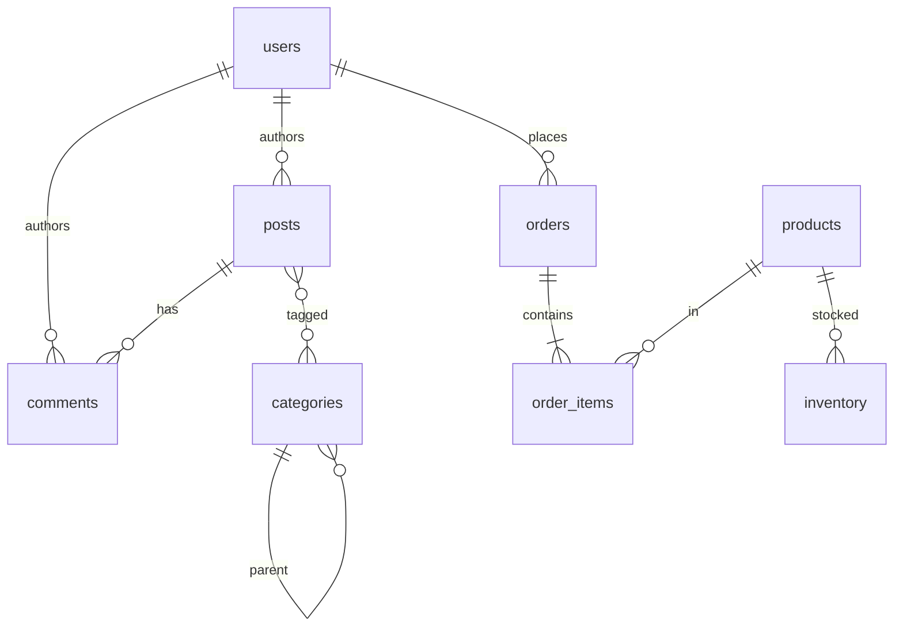

# 03 — Schema Design

By the end you can:
1. Pick the right Postgres type for a column (and explain the trade-off vs alternatives).
2. Enforce data integrity with `NOT NULL`, `CHECK`, `UNIQUE`, `PRIMARY KEY`, and `FOREIGN KEY` constraints.
3. Normalize a denormalized table to 3NF and recognize when to keep redundancy on purpose.

**Time budget:** 60 min reading + 45 min lab.

## Data types you actually use

Postgres ships dozens of types. In 95% of schemas you reach for ten.

| Category | Type | When to use | When to avoid |
|----------|------|-------------|---------------|
| Identifiers | `bigint` + `GENERATED ALWAYS AS IDENTITY` (or `bigserial`) | All primary keys, defaulting to 64-bit | Don't use `serial`/`int` for new tables — exhausting 2.1B is real and migration is painful. |
|              | `uuid` (random or v7) | Distributed ID generation, opaque public IDs | Higher index size; random UUIDs hurt insert locality. |
| Strings  | `text` | Default for any string | Don't pick `varchar(n)` for "documentation" — `n` enforces a limit that is hard to change. |
|          | `varchar(n)` | Only when the limit is a real constraint (e.g. ISO codes) | |
|          | `citext` | Case-insensitive comparisons (emails, usernames) | Extension; slower than `text` with explicit `lower()`. |
| Integers | `integer` / `bigint` / `smallint` | Counts, FK references | |
| Decimals | `numeric(p, s)` | **Money**, scientific, exact arithmetic | `float`/`real` for money — rounding bites. |
|          | `double precision` | Statistics, ML features, geographic | Anything that must be exact. |
| Time     | `timestamptz` | **Always** for moments in time | `timestamp` (without tz) — silent timezone bugs. |
|          | `date`, `time` | Calendar dates, clock times | |
|          | `interval` | Durations | |
| Boolean  | `boolean` | True/false flags | Don't model with `char(1)` or `0/1`. |
| Structured | `jsonb` | Semi-structured payloads | When schema is stable, prefer real columns. |
|            | `array` (`text[]`, `int[]`) | Small, unordered sets that always travel with the row | Don't model many-to-many with arrays. |
| Binary   | `bytea` | Small blobs (< 1 MB) | Large blobs — keep in object storage, store URLs. |
| Network  | `inet`, `cidr`, `macaddr` | IPs, ranges | |
| Enums    | `CREATE TYPE x AS ENUM (...)` | Closed, rarely-changing set | If values churn, use a lookup table + FK. |
| Vectors  | `vector(n)` (pgvector extension) | Embeddings | |

Source for type details: <https://www.postgresql.org/docs/17/datatype.html>.

### Money

Use `numeric(12, 2)` for currencies or store integer **cents** in `bigint`/`integer`. The seed uses `price_cents integer` — simpler arithmetic and indexes, with no float surprises.

### Time

Always `timestamptz`. Postgres stores it as UTC internally; the type only affects rendering. `timestamp` (no tz) is a footgun: two services in different timezones will silently disagree. Read [Date/Time Types](https://www.postgresql.org/docs/17/datatype-datetime.html#DATATYPE-TIMEZONES).

## Constraints

| Constraint | Purpose |
|------------|---------|
| `NOT NULL`     | Reject rows where this column is unknown. Cheap. |
| `CHECK (expr)` | Reject rows violating an expression. Use for ranges, enum-likes, format validation. |
| `UNIQUE`       | Disallow duplicates. Creates a btree index automatically. |
| `PRIMARY KEY`  | `UNIQUE` + `NOT NULL` + the row's canonical identity. |
| `FOREIGN KEY ... REFERENCES other(...) [ON UPDATE …] [ON DELETE …]` | Enforce referential integrity. |
| `EXCLUSION` (`EXCLUDE USING gist`) | Reject rows that overlap by some operator (e.g. no two reservations on the same room+time range). |

`ON DELETE` options:
- `NO ACTION` (default) — same as `RESTRICT` unless deferred.
- `RESTRICT` — error immediately on delete of referenced row.
- `CASCADE` — delete dependents too.
- `SET NULL` — set FK to NULL (requires column nullable).
- `SET DEFAULT` — use column default.

Use `CASCADE` deliberately — it can wipe a lot of data. For audit-heavy tables prefer `RESTRICT` and let the application explain the failure.

### Constraints worked example

```sql
CREATE TABLE billing.invoice (
    id           bigint GENERATED ALWAYS AS IDENTITY PRIMARY KEY,
    customer_id  bigint NOT NULL REFERENCES billing.customer(id) ON DELETE RESTRICT,
    period_start date   NOT NULL,
    period_end   date   NOT NULL,
    amount_cents integer NOT NULL CHECK (amount_cents >= 0),
    status       text   NOT NULL CHECK (status IN ('draft','issued','paid','void')),
    CONSTRAINT invoice_period_valid CHECK (period_end > period_start),
    CONSTRAINT invoice_unique_period UNIQUE (customer_id, period_start, period_end)
);
```

The named constraints (`invoice_period_valid`, `invoice_unique_period`) make error messages and migrations clearer — Postgres will refer to them by name when they fire.

## Normalization in one page


**Working definition (3NF):** every non-key column depends on the key, the whole key, and nothing but the key.

Anti-patterns to fix:
- A `users` table with `country_name`, `country_code`, `country_population` — extract a `countries` table.
- A `posts.author_name` column duplicating `users.full_name` — drop it and join.
- An `order` row storing 10 product columns — pull lines into `order_items`.
- Comma-separated values in one column (`tags: "a,b,c"`) — use `text[]` or a junction table.

**When to denormalize on purpose:** read-heavy reporting tables, materialized views, caching computed totals (then enforce with a trigger — module 08). Always know **why** the redundancy exists and how it stays consistent.

## ER modeling for the course schema



Cardinality reads as: a user has zero-or-more posts (`||--o{`), an order has one-or-more items (`||--|{`), categories form a tree via self-reference.

## Surrogate vs natural keys

| Surrogate (`bigint id`) | Natural (e.g. `email`) |
|--------------------------|------------------------|
| Stable across updates    | Can change (people rename, codes get reused) |
| Smaller in indexes (8 bytes vs variable text) | Self-documenting |
| Needs a separate uniqueness constraint on the natural attribute | Doubles as the PK |

Default to surrogate `bigint`. Add a `UNIQUE` constraint on the natural key. The seed schema follows this pattern.

## Identity vs serial

```sql
-- Old (pre-10):
CREATE TABLE t (id bigserial PRIMARY KEY);

-- Preferred (SQL-standard, since Postgres 10):
CREATE TABLE t (id bigint GENERATED ALWAYS AS IDENTITY PRIMARY KEY);
```

`GENERATED ALWAYS` prevents accidental client-supplied IDs (use `OVERRIDING SYSTEM VALUE` for backfills). The seed uses `bigserial` for brevity, both are fine for new code, but `IDENTITY` is the ANSI form.

Docs: <https://www.postgresql.org/docs/17/ddl-identity-columns.html>.

## Generated columns

The seed's `posts.fts` is a `GENERATED ... STORED` column: Postgres maintains it from `title` and `body`. Use generated columns for derived data that you want to index. Note that `STORED` is the only kind supported in core Postgres 17 (no `VIRTUAL` yet).

## Run the lab

```powershell
psql -U postgres -d pgcourse -f 03-schema-design/lab.sql
```

## References

- Data types: <https://www.postgresql.org/docs/17/datatype.html>
- Constraints: <https://www.postgresql.org/docs/17/ddl-constraints.html>
- Identity columns: <https://www.postgresql.org/docs/17/ddl-identity-columns.html>
- Generated columns: <https://www.postgresql.org/docs/17/ddl-generated-columns.html>

## Next

[Module 04 — Indexes &amp; EXPLAIN →](../04-indexes-explain/)
