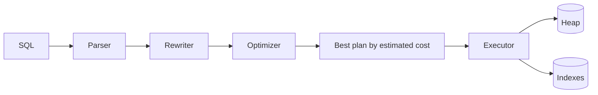

# 04 — Indexes &amp; EXPLAIN

By the end you can:
1. Choose between btree, hash, GIN, GiST, SP-GiST, and BRIN indexes for a given query pattern.
2. Read `EXPLAIN (ANALYZE, BUFFERS)` output and identify the cost driver in a plan.
3. Use partial, expression, and covering indexes deliberately, and know when an index hurts.

**Time budget:** 75 min reading + 60 min lab.

## Mental model



The planner is **cost-based**. It estimates how many rows each operator will produce (cardinality) and how many pages it will read, then picks the cheapest plan. Most "why is my query slow" problems are estimation problems — bad statistics, missing index, or a predicate the planner can't reason about.

## Index types in core Postgres

| Type | Best for | Key ops it accelerates | Notes |
|------|----------|------------------------|-------|
| **btree** | Equality, ranges, `ORDER BY`, prefix `LIKE` | `=`, `<`, `<=`, `>=`, `>`, `BETWEEN`, `IN`, `IS NULL`, `LIKE 'foo%'` | The default. Composite `(a, b, c)` supports any leading-column prefix. |
| **hash**  | Equality only on a single column | `=` | Crash-safe and WAL-logged since PG 10. Rarely beats btree; use only after measuring. |
| **GIN**   | Many values per row | `@>`, `?`, `?\|`, `?&amp;`, `@@` (FTS), `&amp;&amp;` (arrays), `jsonb_path_ops` | Larger and slower to build than btree but great for `tags text[]`, `jsonb`, `tsvector`. |
| **GiST**  | Geometric, ranges, FTS (alt), trigrams, kNN | `&amp;&amp;`, `@>`, `<<`, `<->` (distance), `%` (pg_trgm) | Lossy; needs recheck. Supports operator classes for custom types. |
| **SP-GiST** | Non-balanced trees (quadtrees, suffix trees) | Same operator families as GiST | Niche. Useful for `inet`, certain geo. |
| **BRIN**  | Very large, naturally ordered tables (time-series, append-only) | Ranges on the ordered column | Tiny index (KBs). Skips blocks of pages. Trades precision for size. |

References: <https://www.postgresql.org/docs/17/indexes-types.html> and the linked pages per type.

### Picking by query

| Query pattern | Index |
|---------------|-------|
| `WHERE user_id = ?`                                            | btree(user_id) |
| `WHERE user_id = ? AND created_at > ?`                         | btree(user_id, created_at) |
| `ORDER BY created_at DESC LIMIT 20`                            | btree(created_at DESC) |
| `WHERE tags @> ARRAY['postgres']`                              | GIN(tags) |
| `WHERE attributes @> '{"color":"red"}'`                        | GIN(attributes jsonb_path_ops) |
| `WHERE to_tsvector('english', body) @@ to_tsquery('vector')`   | GIN(fts) on a stored `tsvector` |
| `WHERE body % 'postgrs'` (fuzzy)                               | GIN or GiST with `pg_trgm` |
| `WHERE created_at BETWEEN ... AND ...` on a 100M-row events table | BRIN(created_at) |
| `WHERE embedding <-> '[...]' LIMIT 10` (ANN)                   | HNSW (pgvector) — covered in module 12 |

## Reading EXPLAIN

Use `EXPLAIN (ANALYZE, BUFFERS)` for real diagnosis. `ANALYZE` runs the query; `BUFFERS` shows page-level I/O.

```sql
EXPLAIN (ANALYZE, BUFFERS)
SELECT id, title FROM app.posts
WHERE author_id = 7 ORDER BY created_at DESC LIMIT 5;
```

Illustrative output:

```
Limit  (cost=0.28..8.34 rows=5 width=24) (actual time=0.029..0.045 rows=5 loops=1)
  Buffers: shared hit=8
  ->  Index Scan Backward using posts_author_created_idx on posts
            (cost=0.28..12.94 rows=8 width=24)
            (actual time=0.027..0.040 rows=5 loops=1)
        Index Cond: (author_id = 7)
        Buffers: shared hit=8
Planning Time: 0.176 ms
Execution Time: 0.082 ms
```

How to read it:
- **Top-down**: `Limit` is the outermost operator; below it is its child.
- **cost=startup..total** is the planner's estimate in arbitrary cost units (mainly `seq_page_cost = 1.0` and `random_page_cost = 4.0`).
- **rows=N width=B** is the planner's row-count estimate and average tuple size.
- **actual time=startup..total** is real wall-clock per `loops`.
- **loops** > 1 means the node was executed multiple times (e.g. inner side of a nested loop). Total time is `actual * loops`.
- **Buffers: shared hit=8** means 8 cached page reads. `read=` would mean misses; `dirtied=` writes.

### Common operators

| Operator | Means | When you see it |
|----------|-------|-----------------|
| `Seq Scan`                 | Full table scan         | Small table or non-selective predicate. Not always bad. |
| `Index Scan`               | Walk btree, fetch rows  | Selective predicate on an indexed column. |
| `Index Only Scan`          | Btree alone answers the query, no heap visit | Covering index + visibility map clean. |
| `Bitmap Index Scan` + `Bitmap Heap Scan` | Build a bitmap of matching tuples, then visit heap in physical order | Multiple predicates, moderate selectivity. |
| `Nested Loop`              | For each outer row, probe inner | Small outer, indexed inner. |
| `Hash Join`                | Build hash of one side, probe with other | Larger inputs without useful indexes. |
| `Merge Join`               | Both inputs sorted, walk together | Pre-sorted inputs (often via index). |
| `Gather` / `Parallel ...`  | Worker processes contribute partial results | Big scans on multi-core. |
| `Sort`                     | Sorting in memory or external (`Sort Method: external merge Disk: ... kB`) | When no useful index ordering. |

### Estimation problems

Two telltale signs:
- `rows=` (estimate) is **orders of magnitude** off from `actual rows=`. Plan is built on a lie.
- The query is fast on a fresh `ANALYZE` but slow under skew.

Fixes, in order of effort:
1. `ANALYZE table;` — refresh stats.
2. Increase `default_statistics_target` for skewed columns (`ALTER TABLE … ALTER COLUMN … SET STATISTICS 1000`).
3. `CREATE STATISTICS ... (ndistinct, dependencies, mcv) ON (col_a, col_b) FROM table;` — multivariate statistics catch correlations the planner otherwise can't see. See <https://www.postgresql.org/docs/17/planner-stats.html#PLANNER-STATS-EXTENDED>.

## Partial, expression, and covering indexes

**Partial** — index a subset of rows:
```sql
CREATE INDEX posts_published_only_idx
    ON app.posts (published_at)
    WHERE published_at IS NOT NULL;
```
Smaller, faster, and the planner uses it for queries with the matching `WHERE`.

**Expression** — index a function of a column:
```sql
CREATE INDEX users_email_lower_idx ON app.users (lower(email));
-- now: WHERE lower(email) = 'alice@example.com' uses the index.
```
Use sparingly: the function must be `IMMUTABLE`.

**Covering** (`INCLUDE`) — non-key columns stored in the index leaf so an `Index Only Scan` can return them without heap visit:
```sql
CREATE INDEX posts_author_covering_idx
    ON app.posts (author_id, created_at DESC)
    INCLUDE (title);
```
Index-only scans also depend on the **visibility map** being current; a recently-mutated table may force heap visits anyway.

## When indexes hurt

- Every write (`INSERT`, `UPDATE`, `DELETE` of an indexed column) must update every relevant index.
- Indexes consume disk and memory in `shared_buffers`.
- Bad indexes can mislead the planner into picking them when a seq scan would be faster on small tables.

Quick checks:
```sql
SELECT relname, indexrelname, idx_scan, idx_tup_read, idx_tup_fetch
FROM pg_stat_user_indexes
ORDER BY idx_scan;
-- Indexes with idx_scan = 0 after weeks of traffic are suspects for removal.
```

## Sargability

A predicate is **sargable** ("Search-ARGument-able") when the optimizer can use an index for it. Common pitfalls that break sargability:

| Non-sargable | Sargable rewrite |
|--------------|------------------|
| `WHERE date_trunc('day', created_at) = '2025-06-10'` | `WHERE created_at >= '2025-06-10' AND created_at < '2025-06-11'` |
| `WHERE lower(email) = 'a@b.com'` (no expression index) | Create the expression index, or store a `lower_email` column. |
| `WHERE coalesce(status, 'paid') = 'paid'`             | Restructure or index the expression. |

## Maintenance

- `VACUUM` reclaims dead-tuple space; `autovacuum` runs it automatically (module 09).
- `REINDEX [CONCURRENTLY]` rebuilds a bloated index.
- `pg_stat_all_indexes` and `pg_statio_user_indexes` give you scan counts and cache hit ratios.

## Run the lab

```powershell
psql -U postgres -d pgcourse -f 04-indexes-explain/lab.sql
```

## References

- Index types: <https://www.postgresql.org/docs/17/indexes-types.html>
- EXPLAIN: <https://www.postgresql.org/docs/17/using-explain.html>
- Planner statistics: <https://www.postgresql.org/docs/17/planner-stats.html>
- Extended statistics: <https://www.postgresql.org/docs/17/planner-stats.html#PLANNER-STATS-EXTENDED>

## Next

[Module 05 — Transactions &amp; MVCC →](../05-transactions-mvcc/)
