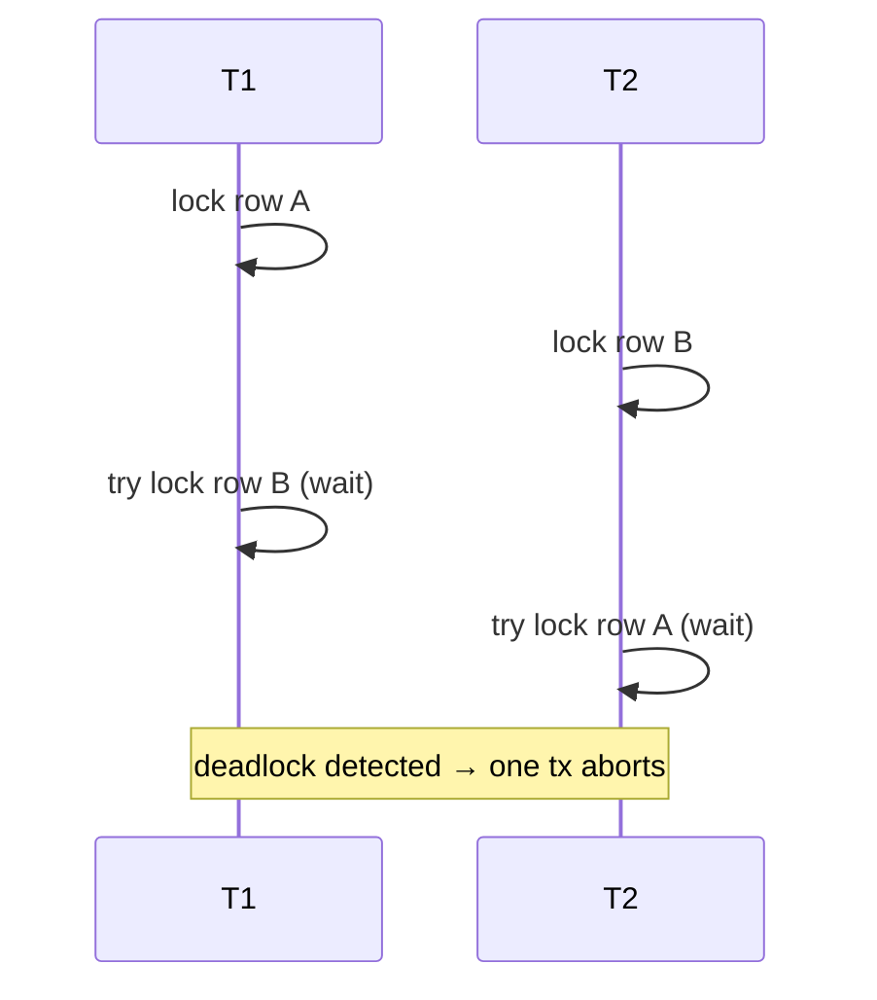

# 05 — Transactions &amp; MVCC

By the end you can:
1. Explain ACID and Postgres's MVCC implementation in one paragraph each.
2. Pick the right isolation level (`READ COMMITTED`, `REPEATABLE READ`, `SERIALIZABLE`) for a workload, and predict the anomalies each prevents.
3. Identify and resolve lock contention and deadlocks; use advisory locks where appropriate.

**Time budget:** 60 min reading + 60 min lab (the lab needs two `psql` sessions side by side).

## ACID, briefly

| Property | What it guarantees | Where Postgres delivers it |
|----------|---------------------|----------------------------|
| **A**tomicity   | All statements in a transaction commit or none do | WAL + commit record |
| **C**onsistency | DB constraints hold at transaction boundaries     | `CHECK`, FK, triggers |
| **I**solation   | Concurrent transactions don't interfere visibly   | MVCC + isolation levels |
| **D**urability  | Committed work survives a crash                   | WAL (synchronous_commit) |

## MVCC in one paragraph

Postgres uses **Multi-Version Concurrency Control**: every row update writes a new row version, the old version stays visible to existing transactions until no snapshot needs it. Readers never block writers and vice versa. A transaction sees a *snapshot* of the database — a consistent point-in-time view. Dead row versions are reclaimed by **VACUUM** later (module 09). See <https://www.postgresql.org/docs/17/mvcc.html>.

```mermaid
sequenceDiagram
    participant T1
    participant T2
    Note over T1,T2: t0 — row v1: balance=100
    T1->>+T1: BEGIN; SELECT balance => 100
    T2->>+T2: BEGIN; UPDATE balance=80 (writes v2)
    T2->>-T2: COMMIT
    T1->>+T1: SELECT balance
    Note right of T1: T1 still sees v1 (=100)<br/>because its snapshot is from t0
    T1->>-T1: COMMIT
```

## Transaction syntax

```sql
BEGIN;                              -- or START TRANSACTION
   UPDATE app.accounts SET balance = balance - 50 WHERE id = 1;
   UPDATE app.accounts SET balance = balance + 50 WHERE id = 2;
COMMIT;
-- ROLLBACK; to abort

SAVEPOINT sp1;                      -- nested checkpoint within a tx
   ... risky stuff ...
ROLLBACK TO SAVEPOINT sp1;          -- partial rollback
RELEASE SAVEPOINT sp1;
```

A statement-level error in a transaction puts the transaction into the `aborted` state — every subsequent statement fails until you `ROLLBACK`. `psql` shows this as `ERROR: current transaction is aborted, commands ignored until end of transaction block`.

## Isolation levels

Standard SQL defines four. Postgres implements three (Read Uncommitted is silently promoted to Read Committed).

| Level | Default? | Prevents | Allows |
|-------|----------|----------|--------|
| **Read Committed** | yes | dirty reads | non-repeatable reads, phantom reads, serialization anomalies |
| **Repeatable Read (Snapshot)** | | dirty + non-repeatable + phantom reads | serialization anomalies, lost updates without explicit locking |
| **Serializable** | | everything above + serialization anomalies | nothing — but transactions may fail with `serialization_failure` and need retry |

Set per transaction:
```sql
BEGIN ISOLATION LEVEL SERIALIZABLE;
```

Postgres's Serializable is implemented with **Serializable Snapshot Isolation (SSI)**: snapshot semantics plus a runtime detector that aborts one of any pair of transactions that, if both committed, would violate serializability. Your application **must** be prepared to retry transactions on `40001` (`serialization_failure`). See <https://www.postgresql.org/docs/17/transaction-iso.html>.

### Which to pick

| Workload | Isolation |
|----------|-----------|
| Most OLTP (default)            | Read Committed |
| Multi-statement read consistency (reports inside a tx) | Repeatable Read |
| Money movement / business-rule invariants where you can't easily reason about all conflicts | Serializable + retry loop |

## Locks

Two main families:

### Row locks
- `FOR UPDATE` — exclusive row lock; other tx must wait. Use to read-then-update.
- `FOR NO KEY UPDATE` — weaker; doesn't block on FK-only references.
- `FOR SHARE` — share lock; allows other shares but not updates.
- `FOR KEY SHARE` — weakest; used internally by FKs.

```sql
BEGIN;
SELECT balance FROM app.accounts WHERE id = 1 FOR UPDATE;
-- holds row lock until COMMIT/ROLLBACK
UPDATE app.accounts SET balance = balance - 50 WHERE id = 1;
COMMIT;
```

### Table locks
DDL takes strong table locks. The strongest is `ACCESS EXCLUSIVE`, taken by `ALTER TABLE ... ADD COLUMN ... DEFAULT (non-volatile)` (in PG 11+ the constant default is metadata-only; volatile defaults still rewrite), `DROP TABLE`, `VACUUM FULL`, `CLUSTER`, etc. Reads block. See <https://www.postgresql.org/docs/17/explicit-locking.html#LOCKING-TABLES>.

| Mode | Conflicts with | Common DDL/operation |
|------|----------------|----------------------|
| ACCESS SHARE      | ACCESS EXCLUSIVE | `SELECT` |
| ROW SHARE         | EXCLUSIVE, ACCESS EXCLUSIVE | `SELECT FOR UPDATE` |
| ROW EXCLUSIVE     | SHARE, SHARE ROW EXCLUSIVE, EXCLUSIVE, ACCESS EXCLUSIVE | `INSERT/UPDATE/DELETE` |
| SHARE             | ROW EXCLUSIVE and above | `CREATE INDEX` |
| SHARE ROW EXCLUSIVE | ROW EXCLUSIVE and above | `CREATE COLLATION`, others |
| EXCLUSIVE         | ROW SHARE and above | `REFRESH MATERIALIZED VIEW CONCURRENTLY` |
| ACCESS EXCLUSIVE  | everything | `DROP TABLE`, `TRUNCATE`, `VACUUM FULL`, `ALTER TABLE` (many forms) |

Use `CREATE INDEX CONCURRENTLY` and `REFRESH MATERIALIZED VIEW CONCURRENTLY` in production to avoid blocking readers.

## Deadlocks

Two transactions each holding a lock the other wants. Postgres detects deadlocks (default check every 1 s) and **aborts one** with SQLSTATE `40P01`.



How to avoid: **always acquire locks in the same order** across code paths. Most application-level deadlocks come from inconsistent ordering of multi-row updates.

## Lost updates: the classic pitfall

```sql
-- Session A and B both run this against the same row:
BEGIN;
SELECT balance FROM accounts WHERE id = 1;   -- both see 100
UPDATE accounts SET balance = 50 WHERE id = 1;
COMMIT;
```

Under Read Committed the second commit overwrites the first — a **lost update**. Fixes:

1. `SELECT ... FOR UPDATE` and recompute under the lock.
2. Use atomic SQL: `UPDATE accounts SET balance = balance - 50 WHERE id = 1` (no read-then-write in app code).
3. Use Repeatable Read or Serializable and handle retries.

## Advisory locks

Application-level locks not tied to any row. Useful for cron-like serialization or coordinating workers.

```sql
-- Try to acquire an advisory lock; returns true if obtained immediately.
SELECT pg_try_advisory_lock(42);
-- ... do single-leader work ...
SELECT pg_advisory_unlock(42);
```

Two-key variant `pg_advisory_lock(class_id, obj_id)` lets you namespace. Locks are session-scoped by default; `pg_try_advisory_xact_lock` is transaction-scoped.

## Idempotency &amp; retries

Always make money-movement, ML-job submission, payment-capture, etc. idempotent via a **unique idempotency key**:

```sql
CREATE TABLE payment_intents (
    idempotency_key uuid PRIMARY KEY,
    user_id bigint NOT NULL,
    amount_cents integer NOT NULL,
    state text NOT NULL CHECK (state IN ('pending','captured','failed')),
    ...
);
```
On retry, the second `INSERT` hits the `PRIMARY KEY` violation; you fetch the existing row and return the same result. Combine with Serializable for end-to-end safety.

## Tools

```sql
-- Currently waiting and blocking sessions
SELECT pid, state, query, wait_event_type, wait_event, blocked_by
FROM pg_stat_activity
WHERE state != 'idle';

-- Who is blocking whom
SELECT blocked_locks.pid AS blocked_pid,
       blocking_locks.pid AS blocking_pid,
       blocked_activity.query AS blocked_query,
       blocking_activity.query AS blocking_query
FROM pg_locks blocked_locks
JOIN pg_stat_activity blocked_activity ON blocked_activity.pid = blocked_locks.pid
JOIN pg_locks blocking_locks
  ON blocking_locks.locktype = blocked_locks.locktype
 AND blocking_locks.database IS NOT DISTINCT FROM blocked_locks.database
 AND blocking_locks.relation IS NOT DISTINCT FROM blocked_locks.relation
 AND blocking_locks.granted
 AND NOT blocked_locks.granted
JOIN pg_stat_activity blocking_activity ON blocking_activity.pid = blocking_locks.pid;
```

`pg_blocking_pids(pid)` is a convenient one-call form added in PG 9.6.

## Run the lab

`lab.sql` is structured into two sessions (A and B). Open two `psql` windows side by side:

```powershell
# Session A
psql -U postgres -d pgcourse
# Session B
psql -U postgres -d pgcourse
```

Run the labeled blocks in order from the file.

## References

- MVCC: <https://www.postgresql.org/docs/17/mvcc.html>
- Transaction isolation: <https://www.postgresql.org/docs/17/transaction-iso.html>
- Explicit locking: <https://www.postgresql.org/docs/17/explicit-locking.html>
- SERIALIZABLE / SSI internals (paper): <https://drkp.net/papers/ssi-vldb12.pdf>

## Next

[Module 06 — Advanced SQL →](../06-advanced-sql/)
