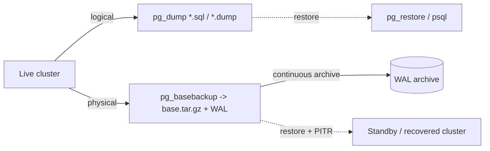
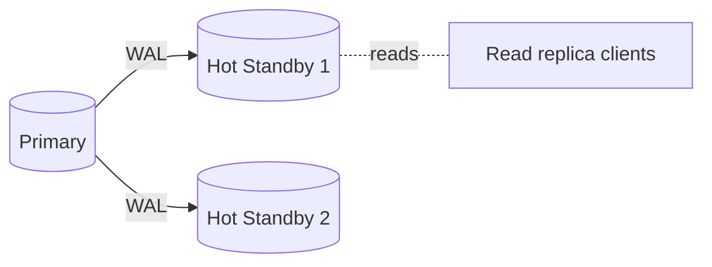

# 09 — Admin &amp; Replication

By the end you can:
1. Manage roles, schemas, and privileges with the right granularity.
2. Take and restore backups with `pg_dump`/`pg_basebackup` and reason about RPO/RTO.
3. Set up streaming and logical replication conceptually, and partition large tables.
4. Read `pg_stat_*` views and tune autovacuum.

**Time budget:** 75 min reading + 45 min lab.

## Roles &amp; privileges

A Postgres role is both a **user** (can log in) and a **group** (can be granted to other roles).

```sql
-- Application user with the least privilege it needs
CREATE ROLE app_owner LOGIN PASSWORD 'change_me';
CREATE ROLE app_rw    NOLOGIN;
CREATE ROLE app_ro    NOLOGIN;
GRANT app_rw TO app_owner;

-- Connect privilege
GRANT CONNECT ON DATABASE pgcourse TO app_rw, app_ro;
GRANT USAGE   ON SCHEMA   app      TO app_rw, app_ro;

-- Object privileges
GRANT SELECT                           ON ALL TABLES    IN SCHEMA app TO app_ro;
GRANT SELECT, INSERT, UPDATE, DELETE   ON ALL TABLES    IN SCHEMA app TO app_rw;
GRANT USAGE, SELECT                    ON ALL SEQUENCES IN SCHEMA app TO app_rw;

-- Future objects (default privileges) — must be issued by the object owner
ALTER DEFAULT PRIVILEGES IN SCHEMA app
    GRANT SELECT ON TABLES TO app_ro;
ALTER DEFAULT PRIVILEGES IN SCHEMA app
    GRANT SELECT, INSERT, UPDATE, DELETE ON TABLES TO app_rw;
```

Notes:
- `PUBLIC` is an implicit role granted to every user. Remove it from sensitive schemas: `REVOKE ALL ON SCHEMA app FROM PUBLIC;`.
- Use **distinct roles** for migrations (DDL) and runtime (DML). The runtime user should not be able to `DROP TABLE`.
- Reset a password without leaking the new value to logs by using `\password` in `psql`.

## Authentication: `pg_hba.conf`

`pg_hba.conf` decides who can connect and how. Order matters — first matching rule wins.

```
# TYPE   DATABASE    USER       ADDRESS         METHOD
local    all         postgres                   peer
host     pgcourse    app_rw     10.0.0.0/24     scram-sha-256
host     all         all        0.0.0.0/0       reject
```

Methods you actually use: `scram-sha-256` (default since PG 14), `peer` (Unix socket, OS user mapping), `cert` (client certificate). Avoid `md5` and `trust` outside throwaway dev.

After editing, `SELECT pg_reload_conf();` or `pg_ctl reload`.

## Backups



### Logical: `pg_dump`

Per-database, format-independent, **portable across major versions**. Good for small/medium DBs and dev snapshots; slow at terabyte scale.

```powershell
# Custom format (recommended) — parallel restore
pg_dump -U postgres -Fc -f pgcourse.dump pgcourse
pg_restore -U postgres -d pgcourse_new --create --jobs=4 pgcourse.dump

# Plain SQL
pg_dump -U postgres -Fp -f pgcourse.sql pgcourse
psql    -U postgres -d pgcourse_new -f pgcourse.sql
```

### Physical: `pg_basebackup` + WAL archiving

Cluster-wide, byte-for-byte. Pair with continuous WAL archiving for **Point-in-Time Recovery (PITR)**. This is how production HA backups work.

```powershell
# Configure on primary: archive_mode = on, archive_command = 'cp %p /archive/%f'
pg_basebackup -U replicator -h primary -D /backup/base -Fp -X stream -P
# Restore: lay base down, set recovery_target_time, point restore_command at /archive
```

### RPO / RTO

- **RPO** (Recovery Point Objective): how much data you can afford to lose. Determines how often you ship WAL or snapshot.
- **RTO** (Recovery Time Objective): how fast you must be back. Determines warm standbys vs cold restores.

Default for "I just want backups": daily `pg_dump` + WAL archive, weekly base backup, tested restore on a schedule. **Untested backups don't exist.**

## Replication

### Streaming (physical) replication

Standby replays WAL records from the primary. Identical byte layout, all databases, no DDL flexibility.



Modes:
- **Async** (default): standby lags primary slightly.
- **Sync** (`synchronous_commit = on`, `synchronous_standby_names`): primary commit waits for one or more standbys to flush. Lower RPO at the cost of latency and availability if the standby goes away.

Quorum sync (`ANY 2 (s1, s2, s3)`) is the production sweet spot.

### Logical replication (per-table, since PG 10)

Publishes row-level changes from a publication on the primary to a subscription on the subscriber. Use when:
- You need a **subset** of tables/columns/rows.
- You're doing **major-version upgrades** with minimal downtime.
- Replicating to a different schema or for ETL.

```sql
-- on publisher
CREATE PUBLICATION app_pub FOR TABLE app.orders, app.order_items;

-- on subscriber (matching schema)
CREATE SUBSCRIPTION app_sub
    CONNECTION 'host=primary user=replicator dbname=pgcourse'
    PUBLICATION app_pub;
```

Constraints: large initial copy can be slow; sequences not replicated automatically; some DDL changes need careful handling. Docs: <https://www.postgresql.org/docs/17/logical-replication.html>.

## Partitioning

Declarative partitioning (since PG 10, improved through PG 17) splits one logical table into physical child tables by key. Use it when a table:
- Is large enough that VACUUM and indexes hurt (rule of thumb: >100 GB or >100M rows).
- Has natural partition keys (time, tenant, region).
- Has queries that filter on the key (so the planner can **prune** partitions).

```sql
-- Range partitioned by month
CREATE TABLE app.events (
    id bigserial,
    user_id bigint NOT NULL,
    occurred_at timestamptz NOT NULL,
    payload jsonb NOT NULL,
    PRIMARY KEY (id, occurred_at)         -- partition key must be in PK
) PARTITION BY RANGE (occurred_at);

CREATE TABLE app.events_2025_06 PARTITION OF app.events
    FOR VALUES FROM ('2025-06-01') TO ('2025-07-01');
```

Patterns:
- **Time-series**: range by day/week/month, drop old partitions instead of `DELETE`. Very fast.
- **Multi-tenant**: list by tenant id when tenants are few and large.
- **Hash partitioning** is rarely the right answer in OLTP; it eliminates pruning for range scans.

Operations:
- `pg_partman` (extension): automates creation/dropping.
- Indexes on partitioned tables: create on the parent, Postgres propagates to children.
- `ATTACH PARTITION ... CONCURRENTLY` and `DETACH PARTITION ... CONCURRENTLY` minimize locking (PG 14+).

## Statistics catalogs

| View | What it tells you |
|------|-------------------|
| `pg_stat_activity`        | Current sessions, their state and query |
| `pg_stat_database`        | Per-db tx/commit/rollback/blocks |
| `pg_stat_user_tables`     | Heap reads, dead tuples, last (auto)vacuum / analyze |
| `pg_stat_user_indexes`    | Per-index scan counts |
| `pg_statio_*`             | Page I/O and cache hit ratios |
| `pg_stat_statements` (ext)| Top queries by total time / mean time / calls — **install this in prod** |
| `pg_stat_replication`     | Replication state and lag per standby |
| `pg_locks`                | Currently held and waiting locks |

Cache hit ratio target: > 99% on indexes, > 95% on heap. Below that, you may be under-provisioned on `shared_buffers` or have a hot working set larger than RAM.

```sql
-- Index hit ratio
SELECT relname,
       sum(idx_blks_hit) / nullif(sum(idx_blks_hit + idx_blks_read), 0)::float AS hit_ratio
FROM pg_statio_user_indexes
GROUP BY relname
ORDER BY hit_ratio NULLS LAST;
```

## Autovacuum

Two jobs:
- **Vacuum**: reclaim dead tuples (left behind by `UPDATE`/`DELETE`) so indexes and the heap don't bloat.
- **Analyze**: refresh planner statistics.

Triggered when `n_dead_tup > autovacuum_vacuum_threshold + autovacuum_vacuum_scale_factor * n_live_tup` (defaults: 50 + 20%).

Tuning:
- Lower `autovacuum_vacuum_scale_factor` for hot tables (e.g. 0.05).
- Increase `autovacuum_max_workers` if many tables are hot.
- Watch `pg_stat_user_tables.n_dead_tup` and `last_autovacuum`.

Reference: <https://www.postgresql.org/docs/17/routine-vacuuming.html>.

## Run the lab

```powershell
psql -U postgres -d pgcourse -f 09-admin-replication/lab.sql
```

## References

- Roles &amp; privileges: <https://www.postgresql.org/docs/17/user-manag.html>
- Authentication (`pg_hba.conf`): <https://www.postgresql.org/docs/17/auth-pg-hba-conf.html>
- Backup &amp; restore: <https://www.postgresql.org/docs/17/backup.html>
- Streaming replication: <https://www.postgresql.org/docs/17/warm-standby.html>
- Logical replication: <https://www.postgresql.org/docs/17/logical-replication.html>
- Partitioning: <https://www.postgresql.org/docs/17/ddl-partitioning.html>
- Routine vacuuming: <https://www.postgresql.org/docs/17/routine-vacuuming.html>

## Next

[Module 10 — Python Integration →](../10-python-integration/)
