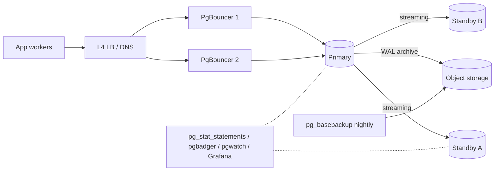

# 11 — Production

By the end you can:
1. Deploy Postgres behind PgBouncer with sane pool sizing and TLS.
2. Pick an HA pattern (primary + standby, Patroni/repmgr, managed) and reason about failover.
3. Enable Row-Level Security (RLS) and write defensive policies.
4. Build a baseline monitoring + alerting plan and tune the top 10 config knobs.

**Time budget:** 75 min reading + 45 min lab.

## Production architecture (typical)



Reasonable defaults:
- Two app-side PgBouncers (HA).
- One primary, two standbys (one quorum-sync, one async cross-AZ).
- WAL archive to object storage with retention long enough to satisfy your RPO.
- Daily logical or weekly physical base backup, **with restore tested monthly**.

## PgBouncer

PgBouncer is a tiny C process that multiplexes many client connections onto a small pool of physical Postgres connections.

| Pool mode | Behavior | Limitations |
|-----------|----------|-------------|
| `session`     | Holds the server connection for the whole client session | Works with everything. Wastes connections in HTTP apps. |
| `transaction` | Returns server to pool at transaction end | Breaks session-scoped features (prepared statements, `LISTEN/NOTIFY`, advisory locks, `SET LOCAL` outside tx, temp tables). Sweet spot for stateless apps. |
| `statement`   | Returns at end of every statement (no transactions) | Only useful for read-only proxies, very niche. |

`pgbouncer.ini` skeleton:
```ini
[databases]
pgcourse = host=primary.internal port=5432 dbname=pgcourse

[pgbouncer]
listen_port = 6432
listen_addr = 0.0.0.0
auth_type = scram-sha-256
auth_file = /etc/pgbouncer/userlist.txt
pool_mode = transaction
max_client_conn = 2000
default_pool_size = 30
reserve_pool_size = 5
server_tls_sslmode = verify-full
server_tls_ca_file = /etc/ssl/certs/ca.pem
ignore_startup_parameters = extra_float_digits,application_name
```

Pool sizing rule of thumb: physical `default_pool_size` ≈ `2 × CPU cores`. Then size your **app-side pool * worker count** to be much higher (PgBouncer will queue). Watch `pgbouncer`'s admin console: `SHOW POOLS;`, `SHOW STATS;`.

### Prepared statements behind PgBouncer

In `transaction` mode, prepared statements (asyncpg/JDBC defaults) break across server swaps. Options:
- **PgBouncer 1.21+** supports server-side prepared statement tracking. Enable `server_prepared_statements = 1` and a recent enough Postgres.
- Disable client-side statement cache (`statement_cache_size=0` in asyncpg, `prepare_threshold=None` in psycopg).

## TLS

Enforce TLS for every non-loopback connection.

On the server:
```
# postgresql.conf
ssl = on
ssl_cert_file = '/etc/postgresql/server.crt'
ssl_key_file  = '/etc/postgresql/server.key'
ssl_ca_file   = '/etc/postgresql/ca.crt'
ssl_min_protocol_version = 'TLSv1.2'

# pg_hba.conf
hostssl all all 0.0.0.0/0 scram-sha-256
hostnossl all all 0.0.0.0/0 reject
```

On the client:
```
PGSSLMODE=verify-full
PGSSLROOTCERT=/etc/ssl/certs/ca.pem
```

`sslmode` values from least to most strict: `disable`, `allow`, `prefer`, `require`, `verify-ca`, `verify-full`. Use `verify-full` outside loopback so a MITM with a stolen cert cannot pretend to be your server.

## High availability

Postgres does not include an automatic failover orchestrator. You pick one:

| Option | Pros | Cons |
|--------|------|------|
| **Patroni** + etcd/consul + HAProxy | Most common open-source HA. Handles leader election, fencing, automated promotion. | Several moving parts; needs a consensus store. |
| **repmgr**                          | Simple, scripted failover. | Less automated; needs human verification. |
| **PgPool-II**                       | Connection pooling + failover + read load balancing. | Complex, history of subtle bugs around query routing. |
| **Managed services** (RDS, Cloud SQL, Aurora, Crunchy Bridge, Neon, Supabase) | They run HA for you. | Less control; vendor-specific quirks. |

Failover decisions you must make ahead of time:
- **Quorum** for sync replication: `ANY 1 (s1, s2, s3)` or `FIRST 1 (s1, s2)`.
- **Fencing**: how does the old primary get prevented from accepting writes after it loses leadership? STONITH, VIP eviction, or PgBouncer rotation.
- **Promotion runbook**: who decides, what they run, what they verify.

## Row-Level Security

RLS attaches policies to a table that restrict the rows a user can see/modify. Useful for multi-tenant apps where the data lives in shared tables.

```sql
ALTER TABLE app.posts ENABLE ROW LEVEL SECURITY;

CREATE POLICY posts_owner_select ON app.posts
    FOR SELECT
    USING (author_id = current_setting('app.user_id')::bigint);

CREATE POLICY posts_owner_modify ON app.posts
    FOR ALL
    USING      (author_id = current_setting('app.user_id')::bigint)
    WITH CHECK (author_id = current_setting('app.user_id')::bigint);
```

Connection setup per request:
```sql
SET LOCAL app.user_id = '42';  -- inside the transaction; cleared on commit
```

Notes:
- Superusers bypass RLS by default. Run app traffic as a non-superuser.
- `BYPASSRLS` role attribute lets specific roles see through policies.
- RLS adds CPU cost; complex `USING` predicates can become the bottleneck. Profile.
- Policies are not a substitute for schema-level GRANT — combine them.

## Performance tuning: the 10 knobs that matter

Start from sensible defaults. Don't tune speculatively. The numbers below are starting points for a single Postgres on a dedicated VM with N GB RAM.

| Setting | Suggested start | What it controls |
|---------|-----------------|------------------|
| `shared_buffers`             | 25% of RAM          | Postgres's own buffer cache. |
| `effective_cache_size`       | 50–75% of RAM       | Planner hint: how much of RAM the OS uses for FS cache. |
| `work_mem`                   | 16–64 MB            | Per-operation sort/hash memory. Multiply by query parallelism. |
| `maintenance_work_mem`       | 1 GB                | For VACUUM/REINDEX/CREATE INDEX. |
| `max_connections`            | 100–200             | Behind PgBouncer you do not need thousands. |
| `random_page_cost`           | 1.1 (SSD)           | Lower for SSDs so the planner is less biased against random I/O. |
| `effective_io_concurrency`   | 200 (SSD)           | Helps bitmap heap scans. |
| `wal_compression`            | on                  | Smaller WAL, more CPU. |
| `checkpoint_completion_target` | 0.9               | Spread checkpoint writes to avoid IO spikes. |
| `autovacuum_vacuum_scale_factor` | 0.05 (hot tables) | Trigger autovacuum earlier on busy tables. |

Always reload (`SELECT pg_reload_conf();`) or restart (some settings need it). Use `pg_settings` to see what is in effect: `SELECT name, setting, source FROM pg_settings WHERE name IN (...)`.

## Monitoring

Minimum viable stack:
- **`pg_stat_statements`**: top-N queries by total/mean exec time.
- **`pgbadger`** or **OtelCol Postgres receiver**: parse logs for slow queries, locks, errors.
- **`postgres_exporter` + Prometheus + Grafana**, or a managed equivalent (Datadog/New Relic/Cloud SQL Insights).
- **Lag alerts**: `pg_stat_replication.replay_lag` and `pg_wal_lsn_diff(sent_lsn, replay_lsn)`.
- **Disk alerts**: free space; WAL accumulation if archiving fails.

Critical alerts you should have on day one:
1. Primary down (no successful login for X seconds).
2. Replica lag > N seconds.
3. Disk free < 20%.
4. Long-running transaction > 1 hour.
5. WAL archive failures > 0 in 5 minutes.
6. Backup job not succeeded in N hours.

## Migrations in production

Online migration patterns (zero-downtime). Order matters:

1. **Add nullable column** (cheap, no rewrite if no default or constant default in PG 11+).
2. **Backfill** in chunks with `LIMIT/SKIP LOCKED` (see module 08's procedure example).
3. **Add a NOT VALID constraint**, then `VALIDATE CONSTRAINT` (lets you avoid the long-rewrite lock).
4. **Create indexes CONCURRENTLY**.
5. **Switch reads** to the new shape.
6. **Switch writes**.
7. **Drop old column/index**.

Operations to avoid in working hours: `ALTER TABLE ... ALTER COLUMN TYPE` that rewrites, `VACUUM FULL`, `CLUSTER`, `REINDEX TABLE` (non-concurrent).

## Run the lab

```powershell
psql -U postgres -d pgcourse -f 11-production/lab.sql
jupyter lab   # for lab.ipynb (RLS + PgBouncer dry-run)
```

## References

- PgBouncer: <https://www.pgbouncer.org/config.html>
- TLS: <https://www.postgresql.org/docs/17/ssl-tcp.html>
- Row-Level Security: <https://www.postgresql.org/docs/17/ddl-rowsecurity.html>
- Server configuration: <https://www.postgresql.org/docs/17/runtime-config.html>
- Patroni: <https://patroni.readthedocs.io/en/latest/>

## Next

[Module 12 — Capstone (RAG with pgvector) →](../12-capstone/)
