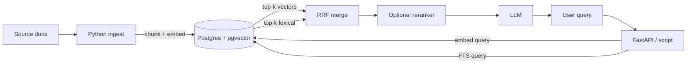
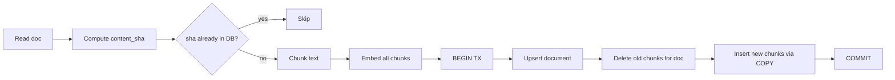

# 12 — Capstone: RAG backend with pgvector

By the end you have:
1. A `pgvector`-backed schema for documents and chunked embeddings with an **HNSW** ANN index.
2. A Python ingestion pipeline that chunks, embeds, and upserts documents idempotently.
3. A **hybrid retrieval** path that combines vector similarity (semantic) and Postgres FTS (lexical), with a `RRF` (reciprocal rank fusion) merge.

**Time budget:** 90 min reading + 120 min lab.

## Why Postgres for RAG

| Property | Why it matters for RAG |
|----------|------------------------|
| Strong consistency        | Re-ingestion replaces stale chunks atomically. |
| Joins on metadata         | Filter by tenant, doc id, language, ACL, freshness in the same query as the vector search. |
| Hybrid search             | FTS, trigram, vector — all in one place. |
| Operability you already know | Backups, replicas, IAM, monitoring all the way you'd run any other Postgres. |
| pgvector indexes (HNSW + IVFFlat) | ANN search with knobs you can tune. |

You typically reach for a dedicated vector DB when you need >100M vectors per index *and* sustained >10k QPS. Below that, pgvector + a reasonable instance is the right answer.

## Architecture



## Schema

```sql
CREATE EXTENSION IF NOT EXISTS vector;
CREATE EXTENSION IF NOT EXISTS pg_trgm;     -- for fuzzy fallback

CREATE SCHEMA IF NOT EXISTS rag;

CREATE TABLE rag.documents (
    id            bigserial PRIMARY KEY,
    source_uri    text   NOT NULL UNIQUE,
    title         text   NOT NULL,
    metadata      jsonb  NOT NULL DEFAULT '{}'::jsonb,
    content_sha   bytea  NOT NULL,            -- to skip re-embedding unchanged docs
    created_at    timestamptz NOT NULL DEFAULT now(),
    updated_at    timestamptz NOT NULL DEFAULT now()
);

CREATE TABLE rag.chunks (
    id            bigserial PRIMARY KEY,
    document_id   bigint NOT NULL REFERENCES rag.documents(id) ON DELETE CASCADE,
    ordinal       integer NOT NULL,           -- chunk position within doc
    text          text   NOT NULL,
    token_count   integer,
    embedding     vector(384) NOT NULL,       -- match your embedding model
    fts           tsvector GENERATED ALWAYS AS (to_tsvector('english', text)) STORED,
    UNIQUE (document_id, ordinal)
);

-- HNSW index (PG 16+ with pgvector 0.5+). Cosine distance is the most common
-- choice for sentence-transformer embeddings.
CREATE INDEX chunks_embedding_hnsw_idx
    ON rag.chunks USING hnsw (embedding vector_cosine_ops)
    WITH (m = 16, ef_construction = 64);

-- FTS index for the lexical leg of hybrid retrieval.
CREATE INDEX chunks_fts_idx ON rag.chunks USING gin (fts);

-- Trigram on title for "Did you mean..." style fallbacks.
CREATE INDEX documents_title_trgm_idx ON rag.documents USING gin (title gin_trgm_ops);
```

### HNSW vs IVFFlat

| | HNSW | IVFFlat |
|---|------|---------|
| Build time | slower | faster |
| Memory | higher | lower |
| Query speed | very fast at high recall | fast, but recall depends on `lists` and `probes` |
| Requires data first | no | **yes** (must `ANALYZE` after data load before building) |
| Recommended default | **yes** | only when memory is the constraint |

Tunable at query time:
- HNSW: `SET LOCAL hnsw.ef_search = 100;` — higher is more accurate, slower.
- IVFFlat: `SET LOCAL ivfflat.probes = 10;`.

### Distance functions

| Operator | Distance | Index op class |
|----------|----------|----------------|
| `<->`  | L2 / Euclidean    | `vector_l2_ops` |
| `<#>`  | negative inner product | `vector_ip_ops` |
| `<=>`  | cosine            | `vector_cosine_ops` |
| `<+>`  | Hamming (binary)  | `bit_hamming_ops` (pgvector 0.7+) |

Match the operator to the embedding model:
- Sentence-Transformers (cosine-normalized): `<=>` cosine.
- OpenAI ada-002 / text-embedding-3-*: `<=>` cosine (vectors are not strictly unit length; cosine is the conventional choice).
- Models specifically trained for dot-product: `<#>`.

## Ingestion pipeline



Why this shape:
- **Content hash** avoids re-embedding unchanged docs (embedding cost matters at scale).
- **Whole-document transaction** keeps the chunk set atomically consistent — a query never sees a half-replaced document.
- **COPY** is the fastest bulk insert.

## Retrieval

### Pure vector search

```sql
WITH q AS (SELECT $1::vector AS qv)
SELECT c.id, c.document_id, c.text,
       1 - (c.embedding <=> q.qv) AS cosine_similarity
FROM rag.chunks c, q
ORDER BY c.embedding <=> q.qv
LIMIT 20;
```

### Filtered ANN

You almost always want metadata filters. Postgres handles pre-filter / post-filter automatically:

```sql
SELECT c.id, c.text
FROM rag.chunks c
JOIN rag.documents d ON d.id = c.document_id
WHERE d.metadata @> '{"tenant":"acme"}'
ORDER BY c.embedding <=> $1::vector
LIMIT 20;
```

For high-selectivity filters, the planner may use the index on `documents.metadata` first; for low-selectivity filters, it'll use the HNSW index then filter. Profile with `EXPLAIN ANALYZE` and tune `hnsw.ef_search` if recall is low after filtering.

### Hybrid retrieval with RRF

Reciprocal Rank Fusion merges two ranked lists by reciprocal of rank. Robust to score-scale mismatch between dense and sparse retrievers.

```
score(d) = sum_over_lists (1 / (k + rank_in_list(d)))
```

`k = 60` is the canonical constant.

```sql
WITH vec AS (
    SELECT id, row_number() OVER (ORDER BY embedding <=> $1::vector) AS r
    FROM rag.chunks
    ORDER BY embedding <=> $1::vector
    LIMIT 50
),
lex AS (
    SELECT id, row_number() OVER (ORDER BY ts_rank(fts, q) DESC) AS r
    FROM rag.chunks, websearch_to_tsquery('english', $2) q
    WHERE fts @@ q
    LIMIT 50
)
SELECT c.id, c.text,
       coalesce(1.0/(60 + v.r), 0) + coalesce(1.0/(60 + l.r), 0) AS rrf
FROM rag.chunks c
LEFT JOIN vec v ON v.id = c.id
LEFT JOIN lex l ON l.id = c.id
WHERE v.id IS NOT NULL OR l.id IS NOT NULL
ORDER BY rrf DESC
LIMIT 10;
```

In practice you also rerank the top ~50 hybrid candidates with a cross-encoder before serving them to an LLM. That step is out of scope for this lab but trivial to bolt on.

## Lab plan

The lab notebook (`lab.ipynb`) walks through:
1. Install `vector` and create the `rag` schema.
2. Load a tiny corpus (5–10 short docs about Postgres).
3. Embed with `sentence-transformers/all-MiniLM-L6-v2` (384-dim, CPU-friendly).
4. Build the HNSW index.
5. Query: pure vector, filtered, hybrid RRF.
6. Tune `hnsw.ef_search` and observe recall vs latency.

```powershell
# Make sure pgvector is installed for your Postgres 17 cluster.
# On EDB Windows: use Stack Builder to add 'pgvector'; or build from source.
# On macOS:   brew install pgvector
# On Linux:   apt install postgresql-17-pgvector  (Debian/Ubuntu repo)
# Then in psql:
psql -U postgres -d pgcourse -c "CREATE EXTENSION IF NOT EXISTS vector;"
psql -U postgres -d pgcourse -f 12-capstone/schema.sql
jupyter lab
```

## What "done" looks like

After running the lab end-to-end you will have:
- `rag.documents` rows for each ingested doc (with content hashes).
- `rag.chunks` with `embedding vector(384)` and a populated `fts`.
- An HNSW index on `embedding` and a GIN index on `fts`.
- A working Python function `retrieve(query, k=10) -> list[Chunk]` using hybrid RRF.

## References

- pgvector: <https://github.com/pgvector/pgvector>
- HNSW paper: <https://arxiv.org/abs/1603.09320>
- Reciprocal Rank Fusion: Cormack et al., 2009 — <https://plg.uwaterloo.ca/~gvcormac/cormacksigir09-rrf.pdf>
- Sentence-Transformers: <https://www.sbert.net/>

## Next

You finished the course. Treat the modules as a reference; come back to module 04 (EXPLAIN) and module 11 (production) whenever you ship something serious.
