# PostgreSQL: Beginner to Advanced

A production-grade PostgreSQL course aimed at AI/ML engineers and backend developers. You will learn schema design, indexing, query planning, transactions, JSONB, full-text search, replication, Python integration, and operations — finishing with a pgvector-based RAG backend.

Pinned to **PostgreSQL 17** (the current stable major as of this course). Features that require older or newer majors are flagged inline.

## Prerequisites

- Comfort with the command line.
- Python 3.11+ installed (for modules 00, 10, 11, 12).
- ~5 GB free disk for Postgres, sample data, and venv.

## Roadmap

```mermaid
flowchart LR
    A[00 Foundations] --> B[01 SQL Basics]
    B --> C[02 Joins &amp; Aggregates]
    C --> D[03 Schema Design]
    D --> E[04 Indexes &amp; EXPLAIN]
    E --> F[05 Transactions &amp; MVCC]
    F --> G[06 Advanced SQL]
    G --> H[07 JSON, Arrays, FTS]
    H --> I[08 Procedures &amp; Triggers]
    I --> J[09 Admin &amp; Replication]
    J --> K[10 Python Integration]
    K --> L[11 Production]
    L --> M[12 Capstone: RAG]
```



## Modules

| #  | Folder | Topic | Time (read + lab) |
|----|--------|-------|-------------------|
| 00 | [00-foundations](./00-foundations/)              | Install Postgres 17, connect with psql/VS Code/pgAdmin, load seed | 45m + 30m |
| 01 | [01-sql-basics](./01-sql-basics/)                | SELECT, WHERE, ORDER BY, LIMIT, NULL semantics                    | 30m + 30m |
| 02 | [02-joins-aggregates](./02-joins-aggregates/)    | JOINs, GROUP BY, HAVING, set operators                            | 45m + 45m |
| 03 | [03-schema-design](./03-schema-design/)          | Types, constraints, normalization, ER modeling                    | 60m + 45m |
| 04 | [04-indexes-explain](./04-indexes-explain/)      | btree/hash/GIN/GiST/BRIN, EXPLAIN ANALYZE, planner                | 75m + 60m |
| 05 | [05-transactions-mvcc](./05-transactions-mvcc/)  | ACID, isolation levels, locks, deadlocks, MVCC                    | 60m + 60m |
| 06 | [06-advanced-sql](./06-advanced-sql/)            | CTEs, recursive CTEs, window functions, LATERAL                   | 60m + 60m |
| 07 | [07-json-arrays-fts](./07-json-arrays-fts/)      | JSONB ops/indexes, arrays, full-text search                       | 60m + 60m |
| 08 | [08-procedures-triggers](./08-procedures-triggers/) | PL/pgSQL functions, procedures, triggers, anti-patterns         | 45m + 45m |
| 09 | [09-admin-replication](./09-admin-replication/)  | Roles, backups, streaming/logical replication, partitioning       | 75m + 45m |
| 10 | [10-python-integration](./10-python-integration/) | psycopg, asyncpg, SQLAlchemy 2.x, alembic, pooling               | 60m + 75m |
| 11 | [11-production](./11-production/)                | pgbouncer, HA, monitoring, TLS, RLS, perf tuning                  | 75m + 45m |
| 12 | [12-capstone](./12-capstone/)                    | pgvector RAG backend: HNSW + hybrid search                        | 90m + 120m |

## Quick start

```powershell
# 1. Install Postgres 17 natively. See 00-foundations/README.md for OS-specific steps.
# 2. Clone &amp; configure
copy .env.example .env
# edit .env with your local PGUSER/PGPASSWORD

# 3. Create the course database and load the seed (see 00-foundations/README.md)
psql -U postgres -c "CREATE DATABASE pgcourse;"
psql -U postgres -d pgcourse -f seed/schema.sql
psql -U postgres -d pgcourse -f seed/data.sql

# 4. Python labs (modules 00, 10, 11, 12)
python -m venv .venv
.venv\Scripts\Activate.ps1
pip install -r requirements.txt
jupyter lab
```

Docker is offered as an alternative path in [`docker-compose.yml`](./docker-compose.yml).

## Repo layout

```
postgreSQL/
  README.md
  docker-compose.yml           # optional: postgres:17 + pgadmin (data in ./pgdata)
  .env.example
  .gitignore
  requirements.txt
  LICENSE
  vscode/                      # recommended extensions and workspace settings
  seed/                        # baseline schema and ~1k rows used across labs
  00-foundations/ ... 12-capstone/
  resources/                   # glossary, cheatsheet
```

Each module folder contains a `README.md` (the lesson), a `lab.sql` (runnable demo), `challenges.md` (problems with hidden solutions), and a `lab.ipynb` only where Python adds value.

## Conventions

- ANSI SQL is preferred where it works. Postgres-specific syntax is flagged.
- Limits/defaults/syntax are linked to the [official Postgres docs][pgdocs].
- Every lesson opens with "By the end you can: 1 / 2 / 3..." plus a time budget.
- Diagrams use Mermaid (renders natively on GitHub).
- No secrets are committed. `.env` is ignored.

## Resources

- [Glossary](./resources/glossary.md)
- [Cheatsheet](./resources/cheatsheet.md)
- [Official Postgres 17 docs][pgdocs]

[pgdocs]: https://www.postgresql.org/docs/17/index.html

## License

[MIT](./LICENSE)
